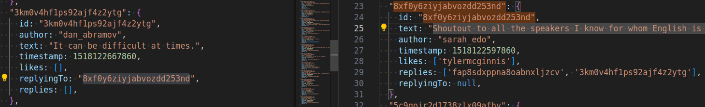

# Note

## Store

- tweets
- users
- authedUser
- loading
- loadingBar : from react-redux-loading-bar


In our application, normalized state would look like this:

```js
{
  tweets: {
    tweetId: { tweetId, authorId, timestamp, text, likes, replies, replyingTo},
    tweetId: { tweetId, authorId, timestamp, text, likes, replies, replyingTo}
  },
  users: {
    userId: {userId, userName, avatar, tweetsArray},
    userId: {userId, userName, avatar, tweetsArray}
  }
}
```

```js
  tweets: {
    "3km0v4hf1ps92ajf4z2ytg": {
      id: "3km0v4hf1ps92ajf4z2ytg",
      author: "dan_abramov",
      text: "It can be difficult at times.",
      timestamp: 1518122667860,
      likes: [],
      replyingTo: "8xf0y6ziyjabvozdd253nd",
      replies: [],
    },
  }

  users : {
    sarah_edo: {
      id: "sarah_edo",
      name: "Sarah Drasner",
      avatarURL: "https://tylermcginnis.com/would-you-rather/sarah.jpg",
      tweets: ['8xf0y6ziyjabvozdd253nd', 'hbsc73kzqi75rg7v1e0i6a', '2mb6re13q842wu8n106bhk', '6h5ims9iks66d4m7kqizmv', '3sklxkf9yyfowrf0o1ftbb'],
    },
  }
```

- cross referencing tweet reply:



## Sequence

1. Get authenticated user
1. Get all data for store (tweets, users, authUser)


## Implementation

- Data & API
- Action (Asynschronous for getting data)
- Reducer
- Store
- Loading bar with associated data in store
- Dashboard Component with sorted Tweet Ids
- Tweet Component with info
- Tweet Component with interactive icons

## Loading Bar

```js
// In Presentation Component
import LoadingBar from "react-redux-loading-bar";
```

## Handling

- User enter invalid id for tweet in URL

## Review

- connect()
- loading bar and data

- props.history : React Router